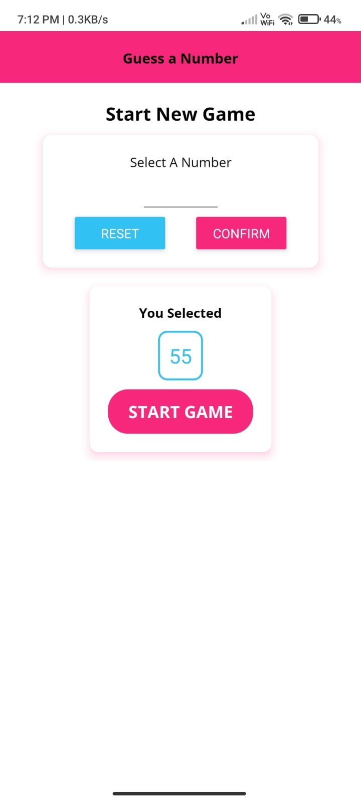
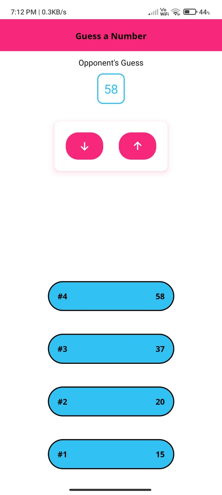
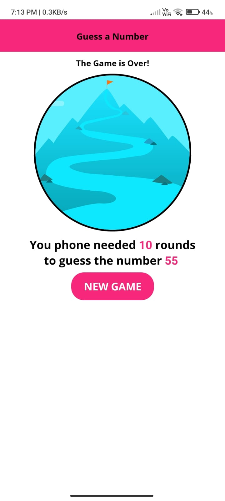

<h1>Guess-X</h1>
• A game to understand components, styling and layout in React Native:

• guessing-game logic and random number generation

• switching between 3 screens (start game, game, game over)

• custom components (header, card, button)

• color theming with constants

• custom fonts with expo-font (AppLoading)

• custom wrapper components (TitleText, BodyText) and global styles (default-styles)

• custom icons with @expo/vector-icons

• displaying local images and online images

• styling (TextInput, nested Text, list and list items)

• using Scrollview and FlatList with flexbox

• using React Native APIs (Alert, Keyboard, Dimensions, Platform)

• using React hooks (useState, useEffect, useRef)

• responsive and adaptative UI (device orientation with ScreenOrientation, dynamic layout with Dimensions and hooks)

• platform-specific code for iOS and Android (Platform)

© Based on React Native - The Practical Guide by Maximilian Schwarzmüller.

<h3>Download Expo-client App on android or ios and scan the barcode to run the App</h3>

<h4>Some ScreenShots</h4>

